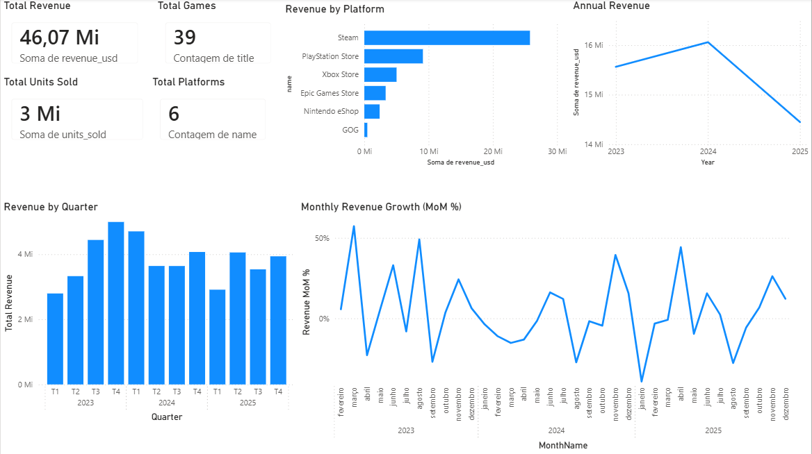
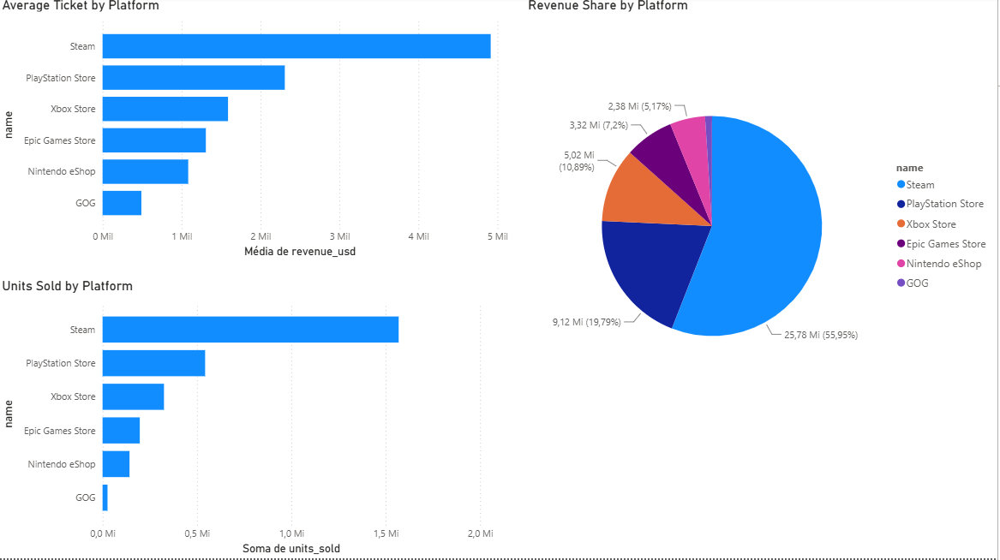
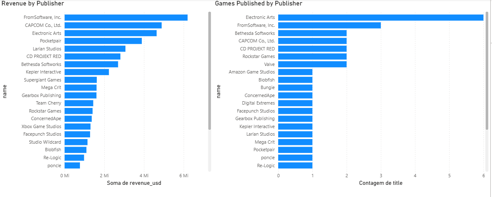
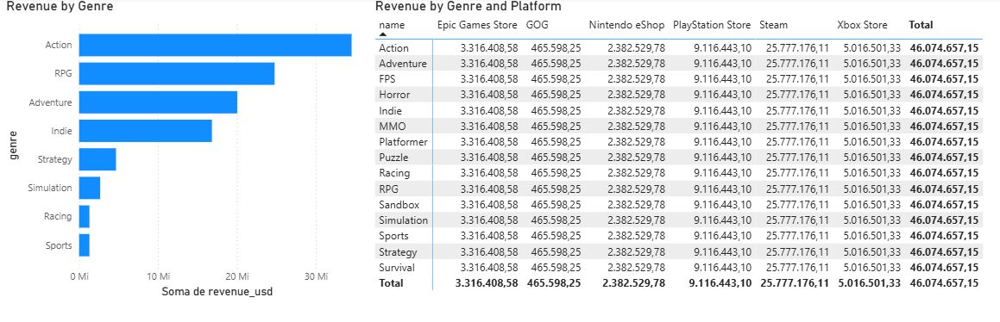
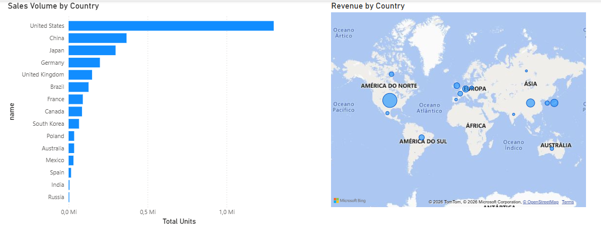
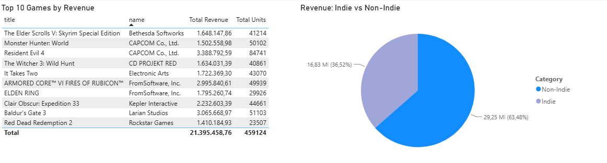

# 🎮 Game Market Intelligence | PostgreSQL + Python + Power BI

[](https://github.com/Danjunq87/game-market-intelligence/actions/workflows/ci.yml)

An end-to-end Data Analytics project that simulates digital game sales across multiple gaming platforms.

The project combines **real game metadata collected from the Steam Store API** with **simulated sales data** to build a complete Business Intelligence solution using **Python, PostgreSQL, SQL and Power BI**.

---

# Project Overview

This project answers common business questions from the video game industry, including:

- Which platform generates the most revenue?
- Which publishers perform the best?
- Which genres sell better on each platform?
- Revenue by country.
- Revenue by quarter.
- Monthly growth.
- Average ticket size.
- Top-performing games.

---

# Tech Stack

- Python
- PostgreSQL
- SQL
- Power BI
- Git
- GitHub

---

# Data Sources

### Real Data

Game metadata are collected from the Steam Store API.

Collected fields include:

- Title
- Publisher
- Developer
- Genres
- Release Date
- Base Price
- Positive Review Score

### Simulated Data

Sales data were generated for educational purposes.

The simulation considers:

- Platform market share
- Country market size
- Review score
- Game age
- Seasonal sales
- Game price

---

# Database Model

Star Schema

Fact Table

- Sales

Dimension Tables

- Games
- Publishers
- Developers
- Platforms
- Countries
- Genres

---

# Business Questions

The SQL scripts answer questions such as:

- Top revenue platform
- Top publishers
- Best-selling genres
- Revenue by country
- Revenue by quarter
- Monthly growth
- Average ticket
- Top games by revenue
- Indie vs AAA comparison

---

# Project Structure

```text
game-market-intelligence/

├── python/
│   ├── 01_fetch_steam_games.py
│   ├── 02_generate_sales.py
│   └── 03_export_sample_data.py
│
├── sql/
│   ├── 01_schema.sql
│   ├── 02_seed_dimensions.sql
│   └── 03_business_queries.sql
│
├── data/
│   ├── sample_data.sql
│   └── sample.db
│
├── powerbi/
│   ├── game-market-intelligence.pbip
│   ├── game-market-intelligence.Report/
│   └── game-market-intelligence.SemanticModel/
│
├── requirements.txt
├── .env.example
└── README.md
```

---

# Skills Demonstrated

- Data Modeling
- ETL Development
- REST API Integration
- SQL Query Optimization
- Window Functions
- Common Table Expressions (CTEs)
- PostgreSQL
- Business Intelligence
- Power BI Dashboard Development

---

# Quick Start (No Setup)

Want to browse the dataset without installing PostgreSQL or hitting the Steam API?

- **SQLite**: open `data/sample.db` with [DB Browser for SQLite](https://sqlitebrowser.org/) or any SQLite client — it's a ready-to-query copy of the full dataset (39 games, 18k+ sales rows).
- **PostgreSQL**: run `sql/01_schema.sql` followed by `data/sample_data.sql` to load the same data into Postgres, skipping steps 2–4 of the full setup below.

---

# Setup

1. Clone the repository and create a virtual environment:

```bash
python -m venv venv
venv\Scripts\activate        # Windows
pip install -r requirements.txt
```

2. Copy `.env.example` to `.env` and fill in your PostgreSQL credentials and Steam API settings.

3. Create the database schema and seed the dimension tables:

```bash
psql -U <user> -d <database> -f sql/01_schema.sql
psql -U <user> -d <database> -f sql/02_seed_dimensions.sql
```

4. Run the Python pipeline to fetch game metadata and generate sales data:

```bash
python python/01_fetch_steam_games.py
python python/02_generate_sales.py
```

5. Explore the business queries in `sql/03_business_queries.sql`, or open `powerbi/game-market-intelligence.pbip` in Power BI Desktop to view the report.

6. (Optional) Regenerate the sample data artifacts in `data/` from your own database:

```bash
python python/03_export_sample_data.py
```

---

# Dashboard

The Power BI report has 6 pages, built on top of the star schema described above.

### Executive Dashboard


### Platform Performance


### Publishers


### Genres


### Countries


### Games


---

# Future Improvements

- Add more Steam games
- Add a Date Dimension
- Add discount simulation
- Add refunds simulation
- Add DLC sales
- Add regional pricing

---

# Disclaimer

Game metadata come from public Steam data.

Sales data are **simulated for educational and portfolio purposes**.